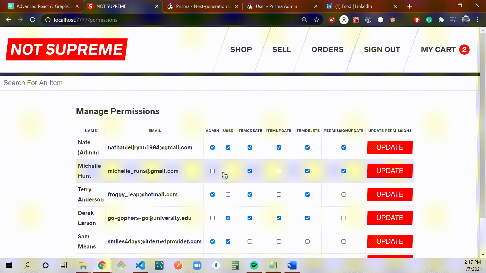
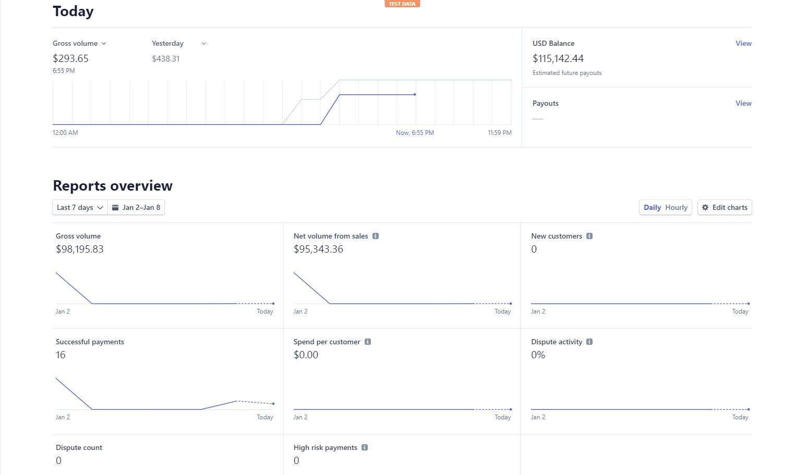

    
    
    
    
    
    

    
    

___
___

    
    <a href="#top">top ⤴</a>

This page is for you to see what I am made of! I built this web application over the course of a month and a half (nearly 130hrs) as a part of a Advanced React and GraphQL course.

Welcome to "NOT SUPREME", a full stack online clothing store complete with real credit checkout. Users can search, sell, add to cart and checkout their favorite items.

The application has five main models — Users, Items, Orders, CartItems, and OrderItems — all of which are relational and showcase the power of relational GraphQL Queries.

The application also includes many server side components including JWT authentication, permissions, sending email, uploading images, and charging credit cards.

In addition to building both the frontend and backend of the application, I also spent the last ⅓ of the course testing the Next.js Frontend for component validity, expected outputs, rendered components with mock rendering, etc.

___
___

 
 <a href="#top">top ⤴</a>

## 
 There is loads of functionality, here are my favorites 

| <a href="#orderd">Ordered</a> || <a href="#orderz">Orders</a> || <a href="#passwordReset">Password Reset</a> || <a href="#manage">Manage Permissions</a> || <a href="#test"> Testing </a> || <a href="#account">Accounting</a> |

## 
Easy Ordering Process

___

## 
Intuitive Orders Page

___

    

## 
Simple Password Reset

___

    

## 
Manage Permissions

___

    

## 
Unit & Mock Testing

___

    

## 
Accounting via Stripe

___
___

 
 <a href="#top">top ⤴</a>

 
 

## React.js

_For Building The Interface along with:_

**Next.js** for server side rendering, routing and tooling

**Styled Components** for styling

**React-Apollo** for interfacing with Apollo Client

**Jest & Enzyme** for Testing
___

## Apollo Client

_For Data Management:_

Performing GraphQL **Mutations**

Fetching GraphQL **Queries**

**Caching** GraphQL Data

Managing **Local State**

**Error** and **Loading** UI States

___
___

 
 <a href="#top">top ⤴</a>

 
 

## GraphQL Yoga

_An Express GraphQL Server For:_

Implementing **Query and Mutation Resolvers**

Custom **Server Side Logic**

**Charging** Credit Cards with Stripe

**Sending** Email

Performing **JWT Authentication**

Checking **Permissions**

___

## Prisma
A GraphQL Database Interface

Provides a set of GraphQL **CRUD APIs** for a MySQL, Postgres or MongoDB **Databases**

**Schema** Definition

Data **Relationships**

**Queried** Directly from the Yoga Server

**Self-hosted** or **as-a-service**

___
___

 

## 
 Hello, I am Nate. 

 

I live in Austin,TX and I am looking for a good job.

| <a href="mailto:nathanieljryan1994@gmail.com">nathanieljryan1994@gmail.com</a> || <a href="tel:5035047581">(503)504-7581</a> || <a href="https://www.linkedin.com/in/nathanieljryan/">LinkedIn</a> || <a href="https://nathanryan.tech/">Portfolio</a> || <a href="https://nathanryan.tech/document/NathanielRyanResume.pdf">Resume</a> |

